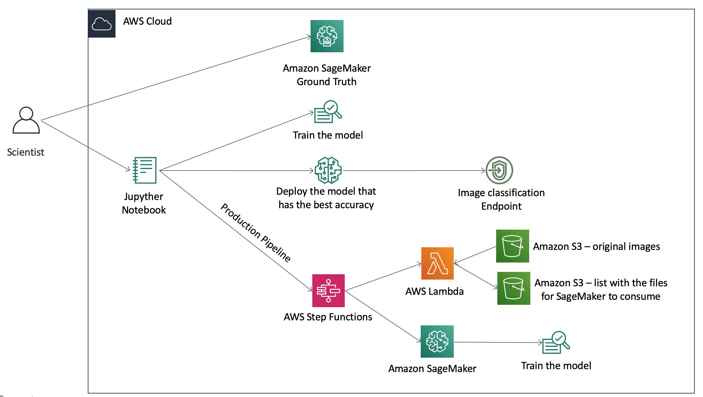
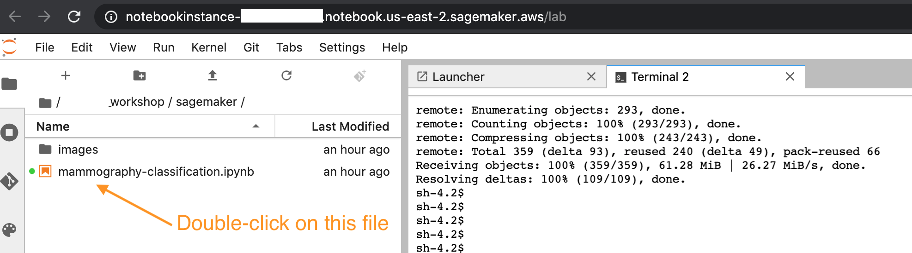
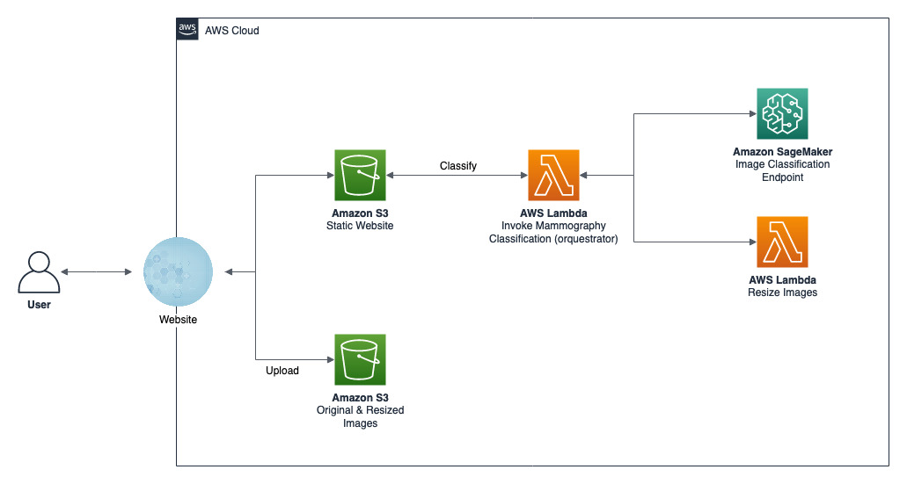

# Amazon SageMaker Mammography Workshop

[1 - Creating the SageMaker Jupyter Notebook](#2---creating-the-sagemaker-jupyter-notebook)

[2 - Presentation](#3---presentation)

[3 - Ground Truth](#4---ground-truth)

[4 - Training, testing, and deploying the Mammography Classification model](#5---training-testing-and-deploying-the-mammography-classification-model)

[5 - Front end](#6---front-end)

[6 - Step Functions](#7---step-functions)

[7 - Clean Up](#8---clean-up)

[8 - Reference Links](#9---reference-links)


Today we will learn how to classify mammography images into 5 different categories using Amazon SageMaker, Amazon GroundTruth, AWS StepFunctions, AWS Lambda, and much more!

You will need to use your own AWS account for this workshop, and all information will be provided through this documentation.

**Let's begin!**

To get started you will need an IAM user with the following access:
- CloudFormation
- S3
- IAM
- Cognito
- Lambda
- SageMaker
- StepFunctions

*Pre-requirements:*
- Service limit of 1 GPU instance type (p2, p3, etc.)
- Service limit to create 2 more buckets


## 1 - Creating the SageMaker Jupyter Notebook

Before we can start the workshop, we need to have a SageMaker Jupyter Notebook deployed in your account. It will also create a bucket for output files.

**CloudFormation**
1. Deploy the following CloudFormation template: https://console.aws.amazon.com/cloudformation/home?#/stacks/create/template?stackName=sagemaker-mammography-workshop&templateURL=https://mammography-workshop.s3.amazonaws.com/cloudformationtemplate/sagemaker_template.yml
2. On the "Step 3 - Configure stack options": Just click on **Next** button
3. On the "Step 4 - Review": Enable the checkbox **I acknowledge that AWS CloudFormation might create IAM resources with custom names.**, and click on **Create Stack** button
4. Wait for the stack to get into status **CREATE_COMPLETE**


## 2 - Presentation

While you wait for the template to be deployed, let's learn from our instructors the motivation behind this workshop and what we plan to deliver today.


## 3 - Ground Truth

Let's navigate to the [Ground Truth lab](groundtruth#sagemaker-ground-truth).

## 4 - Training, testing, and deploying the Mammography Classification model

The architecture below represents what we will deploy today:



In order for us to do that, we will need to open the Jupyter Notebook created in step 1.

1. Open the SageMaker Notebook console at https://console.aws.amazon.com/sagemaker/home#/notebook-instances
2. Click on **Open JupyterLab**
3. In SageMaker, click on **Git** and then **Open Terminal**. Execute the code below in the terminal:
    ```
    cd SageMaker
    git clone https://github.com/gabrielmartinigit/melissa_workshop.git
   
    ```
If successful, you should see a message like this:

>Receiving objects: 100% (359/359), 61.28 MiB | 26.27 MiB/s, done.
>Resolving deltas: 100% (109/109), done.

4. In the File Browse, open the notebook with the name mammography-classification.ipynb:




5. Now follow the instructions described in the notebook.  

## 5 - Front end

We will now deploy a front-end static application in order for us to test our model.

The client application architecture is depicted below:




1. Go back to the Git terminal you opened previously. 

2. Now navigate to the **deploy** folder:
    ```
    cd melissa_workshop/deploy
    ```
3. Open a new tab in your browser and navigate to:
    https://console.aws.amazon.com/sagemaker/home#/endpoints

4. Copy the last successful endpoint-name. It will look like this: 'image-classification-2020-01-13-09-58-43-599'

5. Run the deploy script. Replace the <<endpoint_name>> below by the endpoint copied in step 4.
    ```
    ./deploy.sh create <<endpoint_name>>
    ```
6. Copy the Client URL from the script output.
It will look something like this: "http://sg-tko-workshop-public-123456789011.s3-website.region.amazonaws.com/"

7. Open the URL in a browser, upload a mammography image and see the results!
Download a sample mammography image here: 

* CC-Right: https://mammography-workshop.s3.amazonaws.com/sample/resize_CCD_564.jpg
* CC-Left: https://mammography-workshop.s3.amazonaws.com/sample/resize_CCE_599.jpg
* MLO-Right: https://mammography-workshop.s3.amazonaws.com/sample/resize_MLOD_682.jpg
* MLO-Left: https://mammography-workshop.s3.amazonaws.com/sample/resize_MLOE_743.jpg
* Not a mammography: https://mammography-workshop.s3.amazonaws.com/sample/resize_NAO_MG_1.3.51.0.7.2949628217.25582.6989.45324.14121.15364.52196.dcm.jpg


## 6 - Step Functions

Let's navigate to the [Step Functions lab](workflow#ml-workflow).


## 7 - Clean Up
* Deleting client app
    1. In the notebook Terminal, run deploy script with delete function
    ```
    cd deploy
    ./deploy.sh delete
    ```
* Deleting SageMaker notebook
    1. Go to [CloudFormation](https://console.aws.amazon.com/cloudformation/home#/stacks) and delete **sagemaker-mammography-workshop** stack
    
* Deleting the SageMaker endpoint
    1. Go to the [SageMaker Endpoints console](https://console.aws.amazon.com/sagemaker/home#/endpoints). Delete the endpoint created during the lab.

## 8 - Reference Links
* AWS CLI: https://docs.aws.amazon.com/cli/latest/userguide/cli-chap-install.html
* Python boto3: https://boto3.amazonaws.com/v1/documentation/api/latest/index.html?id=docs_gateway
* SageMaker: https://docs.aws.amazon.com/sagemaker/latest/dg/gs.html

## License Summary
This sample code is made available under the MIT-0 license. See the LICENSE file.