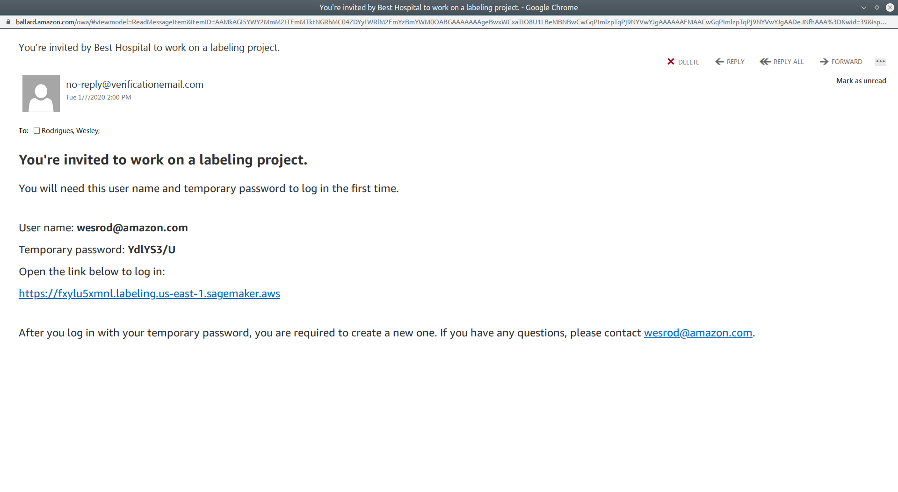
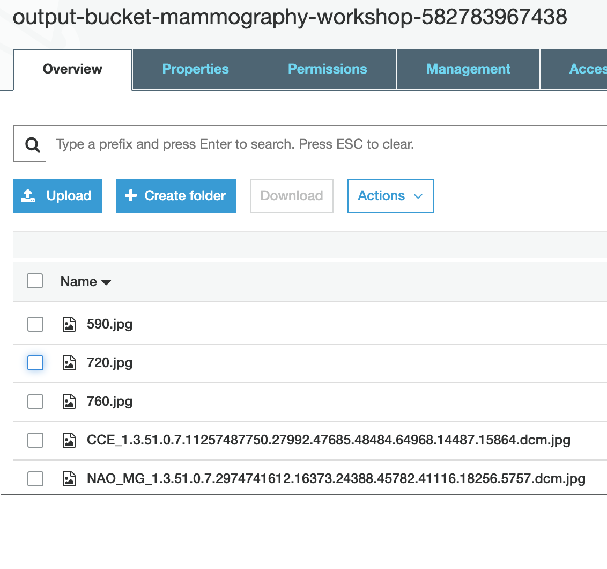
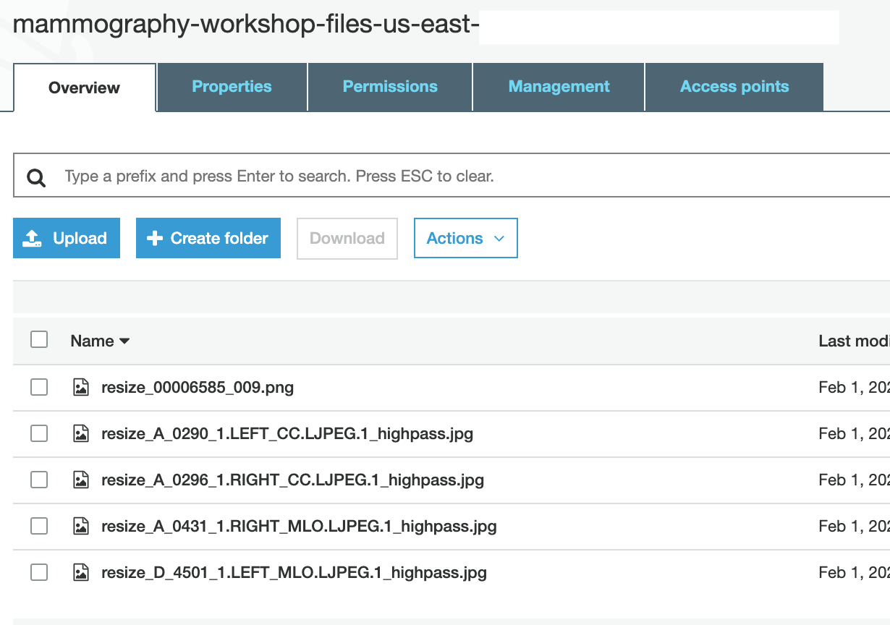
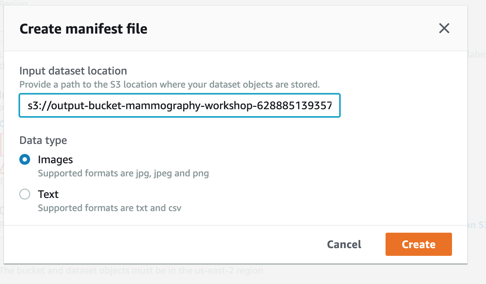
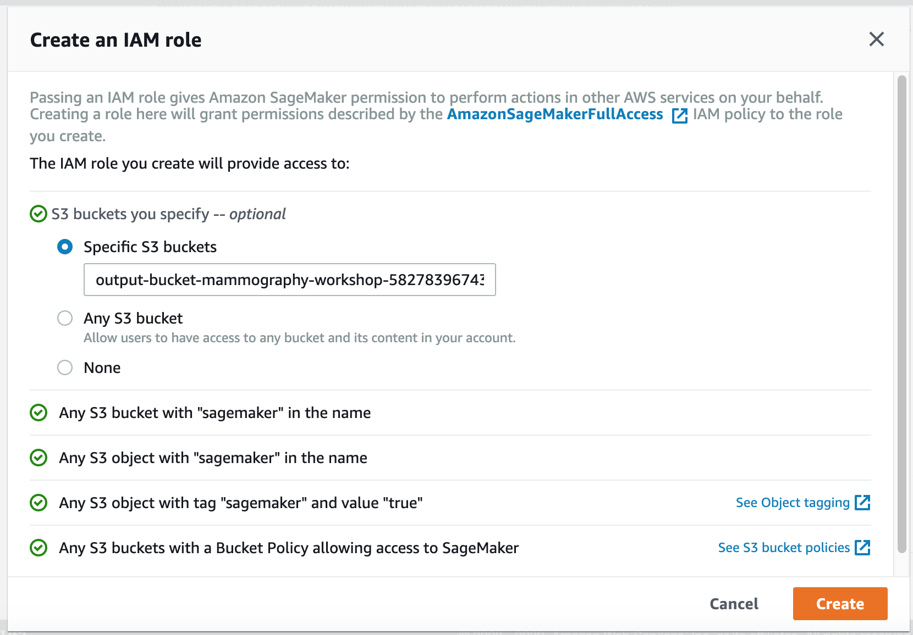
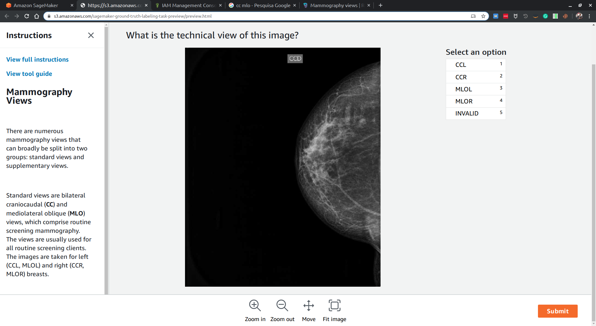
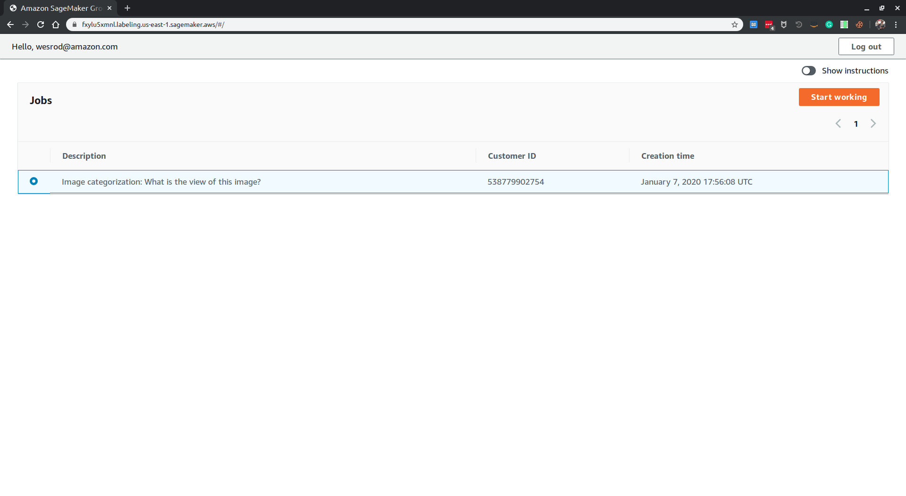
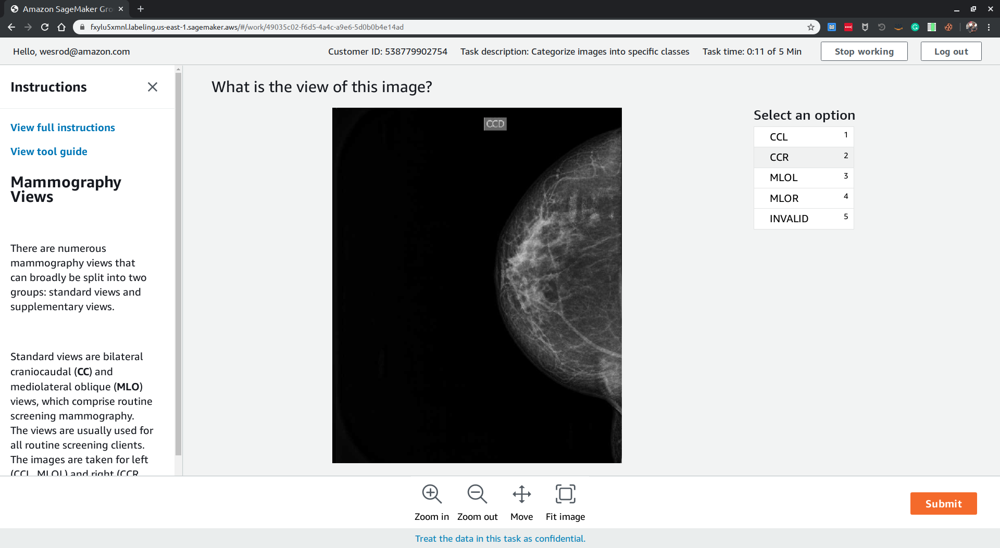
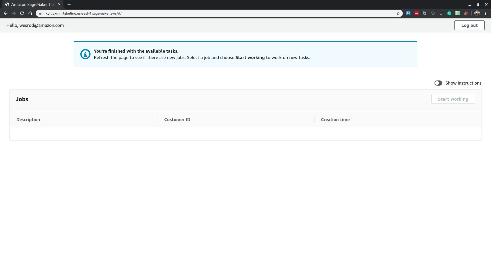

# SageMaker Ground Truth

## The Ground Truth problem

To train a machine learning model using a supervised approach, you need a large, high-quality, labeled dataset.
The term "Ground truth" may be seen as a conceptual term relative to the knowledge of the truth concerning a specific question. It is the ideal expected result.
This is used in statistical models to prove or disprove research hypotheses. The term "ground truthing" refers to the process of gathering the proper objective (provable) data for this test.

SageMaker Ground Truth helps you build high-quality training datasets for your machine learning models. With Ground Truth, you can use workers from either Amazon Mechanical Turk, a vendor company that you choose, or an internal, private workforce along with machine learning to enable you to create a labeled dataset. You can use the labeled dataset output from Ground Truth to train your own models. You can also use the output as a training dataset for an Amazon SageMaker model.

## Workers

A workforce is the group of workers that you have selected to label your dataset. You can choose either the Amazon Mechanical Turk workforce, a vendor-managed workforce, or you can create your own private workforce to label or review your dataset. Whichever workforce type you choose, Amazon SageMaker takes care of sending tasks to workers.

When you use a private workforce, you also create work teams, a group of workers from your workforce that are assigned to specific jobs— Amazon SageMaker Ground Truth labeling jobs or Amazon Augmented AI human review tasks. You can have multiple work teams and can assign one or more work teams to each job.

## Our classification challenge

Mammography (also called mastography) is the process of using low-energy X-rays to examine the human breast for diagnosis and screening. The goal of mammography is the early detection of breast cancer, typically through detection of characteristic masses or microcalcifications.


There are 2 most common views for a mammography exam:

- craniocaudal view (aka CC view)
- mediolateral oblique view (aka MLO view)

Each view contains one picture for the left breast and one for the right breast.
So, for a common exam, we have at least four pictures:

- CCL
- CCR
- MLOL
- MLOR

Our challenge here is not to detect diseases looking in the images.

We want to properly classify an image using one of the four descriptions above, and be able to say if an image is not a mammography.


## Step 1: Creating a private workforce

The first step is to define who is going to classify our images.
We have a team of doctors able to properly classify and label our mammography pictures, so we are about to create a private team
and add our doctors.

Login to **AWS Console**:


Search for **SageMaker** and open **Ground Truth**:


Open **Labeling workforces** and select **Private**:


Click on **Create private team**, give your team a cool name, add some people, give an organization name, an email for contact, and click **Create private team**:


You should see a successful green message like the one below.


After a few minutes, each member of the list will receive an e-mail like this:



Follow the e-mail steps, change the password and this will be your first login screen:


## Step 2: Defining a labeling job

Now that we have a workforce, we need to upload the images we need to classify to Amazon S3. After that, we will create a labeling job and assign it to a private team.

Ground Truth expects the data to be classified to be stored in S3, so let's upload them.

### Part 1: Uploading the images

All the mammography images you need are in the Git repository you cloned.
They are inside the folder **groundtruth/mammography/**
**If you did not clone the repository**, there is a **zip file** in the same directory. You can [download it](/groundtruth/mammography/mammography-to-download.zip) locally for the next step.


Open the **Amazon S3 Console** and open the bucket whose name begins with **output-bucket-mammography-workshop**:



Upload the mammography **images** you want to label, i.e, the ones in the folder **groundtruth/mammography/**:



Record this bucket's name for the next part.


### Part 2: The creating a job

Open the **SageMaker Console**, look for **Ground Truth** and **Labeling jobs**, then click on **Create labeling job**:


Define a name for your job, something very cool like **mammography-views**. 

A labeling job requires a **manifest.json** file containing the location of your images. 

This file can be automatically generated by AWS. For that, click on **Create manifest file**, and then paste the S3 folder name where we uploaded the mammography files in the previous step.



Define a place to save the output results, and create **an IAM role** for execution:



In the task type, select **Image Classification**:


Click next. In **Workers**, select **Private**, and find our team in **Private Teams**:


In **Image classification labeling tool**, define the labels and provide some guidance for the workers:


Take a look in the preview window, if you want:



Finally, create the job:


The state **In Progress** indicates that you job is active, waiting for your labeling team.

## Step 3: Classifying the images

It is time to classify! The team's members will see, after some minutes, that there is a new job on their console:



Click on **Start working**. Some images will be presented and you need to choose a proper label:



Invalid images will also appear:


When you finish, a message will be displayed:



The job status will change to **complete** in SageMaker Ground Truth console:


## Results: The output JSON

The output folder was set to **s3://mammography-images-for-labeling/output/**. After the classification, new folders were created, and inside **<job_name>/manifests/output/** there is a file named **output.manifest**. Download it and let's analyze its lines.

```json
{"source-ref":"s3://mammography-images-for-labeling/ccd_1.png","mammography-views":1,"mammography-views-metadata":{"confidence":0.77,"job-name":"labeling-job/mammography-views","class-name":"CCR","human-annotated":"yes","creation-date":"2020-01-07T18:09:52.624174","type":"groundtruth/image-classification"}}

{"source-ref":"s3://mammography-images-for-labeling/mlod_1.png","mammography-views":3,"mammography-views-metadata":{"confidence":0.76,"job-name":"labeling-job/mammography-views","class-name":"MLOR","human-annotated":"yes","creation-date":"2020-01-07T18:08:39.586251","type":"groundtruth/image-classification"}}

{"source-ref":"s3://mammography-images-for-labeling/none_1.png","mammography-views":4,"mammography-views-metadata":{"confidence":0.66,"job-name":"labeling-job/mammography-views","class-name":"INVALID","human-annotated":"yes","creation-date":"2020-01-07T18:07:24.500252","type":"groundtruth/image-classification"}}

```

Each line contains a classified image, with its address in S3, its label and other useful information.

## Final considerations

The generated file can be used in SageMaker, but you can also consume it in Python notebooks (imported as a simple JSON file) and many other solutions. Let's check in the next labs.
